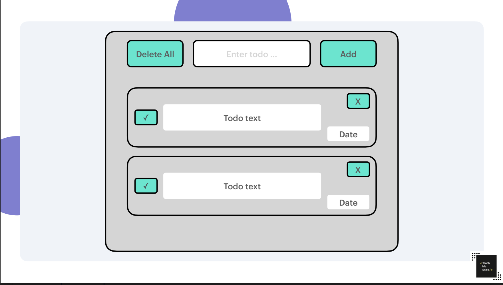

< TeachMeSkills />

<h1 align='center'>TO-DO LIST</h1>

## Complete exercise

#### Task 1 💻

+ Создать новую ветку `name/dev`
+ Создать в ней файл `index.html`
+ Создать в ней папки `scripts` и `styles`
+ Добавьте файл `index.js` в папку `scripts`
+ Добавьте файл `styles.css` либо `styles.scss` в папку `styles`
+ Создать ветку name/feature/create-template
+ Начать делать `Task 2` в feature ветке 

 PS: Можно использовать любую css библиотеку. Например:

 - [Tailwind](https://tailwindcss.com/)
 - [Bootstrap](https://getbootstrap.com/)

 Если используем Bootstrap то, файлы JS из этой библиотеки не подключаем, только стили!

#### Task 2 💻

+ В ``HTML`` разметке создайте ``div`` с ``id='root'``
+ Подключить файлы `styles.css/scss` `index.js` 
+ Реализуйте верстку ``HTML`` полностью динамически с помощью javascript в созданный ``div id='root``

#### NORMAL level

#### EXTREME level

